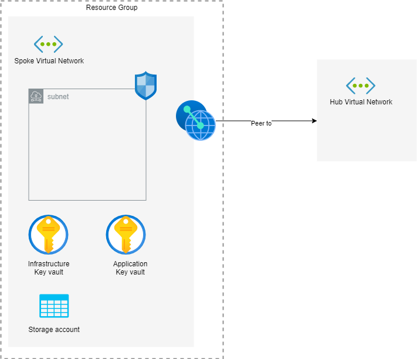

# infrastructure.azure.network.spoke

The `infrastructure.azure.network.spoke` repository stores the resource configuration files for
[Terraform](https://www.terraform.io/) to deploy a
[resource group](https://docs.microsoft.com/en-us/azure/azure-resource-manager/management/overview#terminology) containing
the spoke part of a hub-and-spoke network using the
[Microsoft recommended Hub-Spoke network topology](https://docs.microsoft.com/en-us/azure/architecture/reference-architectures/hybrid-networking/hub-spoke) to an Azure subscription.

The Terraform code in this repository is based on the [Spoke repository](https://github.com/avinor/terraform-azurerm-virtual-network-spoke)
by [avinor](https://github.com/avinor)

The Terraform configuration creates the following group of resources:

* One resource group to contain all the resources.
* A [key vault](https://docs.microsoft.com/en-us/azure/key-vault/general/overview)
  for the infrastructure.
* A key vault for application data, e.g. Consul certificates and tokens
* A [storage account](https://docs.microsoft.com/en-us/azure/storage/common/storage-account-overview)
  to store the flow logs created by the
  [Network Watcher](https://docs.microsoft.com/en-us/azure/network-watcher/network-watcher-monitoring-overview).
* The [virtual network](https://docs.microsoft.com/en-us/azure/virtual-network/virtual-networks-overview)
  for the spoke.
* Role assignments that alow users to connect a Spoke network to peer with the Hub network.
* A subnet that spans the entire vnet
* [Route table](https://docs.microsoft.com/en-us/azure/virtual-network/virtual-networks-udr-overview) and associated entries the subnet
* [Network security group](https://docs.microsoft.com/en-us/azure/virtual-network/network-security-groups-overview) attached to the subnet
* [Network Watcher](https://docs.microsoft.com/en-us/azure/network-watcher/network-watcher-monitoring-overview) logs for the virtual network
* Azure monitor diagnostics settings for:
  * The management subnet
  * The DMZ subnet
* [Private DNS](https://docs.microsoft.com/en-us/azure/dns/private-dns-overview)
  links to the private DNS in the hub.
* An AzureAD group that allows managed identities attached to the VMs inside the spoke
  network to [discover the Consul server nodes](https://www.consul.io/docs/install/cloud-auto-join#microsoft-azure).

During the creation of the spoke resources several connections are made to a Hub
network, a Network watcher in the region and a log analytics workspace. These
resources are found by names, where these names are currently encoded in the
Terraform `main.tf` file.

Most resources are named after the type of resource they are, e.g. `-rg` for the resource group, prefixed with a standard prefix. The prefix consists of
a combination of the Environment, e.g. Production, the Azure location,
e.g. Australia East, and a category, in this case `nwk-spoke`:

    ${var.environment_short}-${var.location_short}-tf-${var.category}

The default values for each of the variables are defined in the `variables.tf` file

* `environment_short` = `p` - For production
* `location_short` = `aue` - For the Australia East region
* `category` = `nwk-spoke`

Which leads to a prefix of: `p-aue-tf-nwk-spoke`

By default the following tags are added:

* **category** - Set to the category. Defaults to `nwk-spoke`
* **environment** - Set to the environment. Defaults to `production`
* **location** - The Azure region in which the resources are created. Defaults to `australiaeast`
* **source** - The commit ID of the current commit
* **version** - The version of the resources

Additional tags can be added by setting the `tags` variable as defined in the `variables.tf` file.

### Network security rules

The network security group for the subnet has the following ports opened for internal traffic only:

* SSH traffic on port `22`
* Consul RPC traffic on port `8300`
* Consul Serf LAN traffic on port `8301`. Rules are provided for both TCP and UDP traffic
* Consul Serf WAN traffic on port `8302`
* Consul HTTP traffic on port `8500`
* Consul DNS traffic on port `8600`. Only TCP traffic is allowed at the moment

## Variables

* **category** - The name of the category that all the resources are running in. Defaults to `nwk-spoke`
* **environment** - The name of the environment that all the resources are running in. Defaults to `production`
* **spoke_id** - The ID of the spoke. Used to uniquely identify different spoke environments. Defaults to `01`.
* **location** - The full name of the Azure region in which the resources should be created. Defaults to `australiaeast`
* **meta_source** - The commit ID of the current commit from which the plan is being created. Used to tag the resources.
* **meta_version** - The version of the infrastructure as it is being generated. Used to tag the resources.
* **address_space** - The full address space that is used the virtual network. Requires at least a /24 address space. Defaults to `10.1.10.0/24`.
* **private_dns_zone** - Name of private DNS zone to associate with virtual network. Defaults to the DNS zone name of the associated hub, `hub.azure.calvinverse.net`. As per the standard guidance it is suggested to use a subdomain of a domain that is registered to you.
* **subscription_production** - The subscription ID of the production subscription. Used to find the log analytics resources.
* **subscription_test** - The subscription ID of the test subscription.
* **tags** - Tags to apply to all resources created.

## Use

In order to run the Terraform configuration in this repository you need to have an Azure subscription and be [connected to that subscription](https://www.terraform.io/docs/providers/azurerm/index.html).

Once you are signed in run the Terraform [plan](https://www.terraform.io/docs/commands/plan.html) command to preview the changes that will be made.

    tf plan -var subscription_production=<SUBSCRIPTION_ID> -var subscription_test=<SUBSCRIPTION_ID> -var meta_source=<GIT_COMMIT_HASH> -var meta_version=<VERSION> -out ./build/tf/plan

When you are happy with the plan execute the plan with the Terraform [apply](https://www.terraform.io/docs/commands/apply.html) command.

    tf apply ./build/tf/plan
